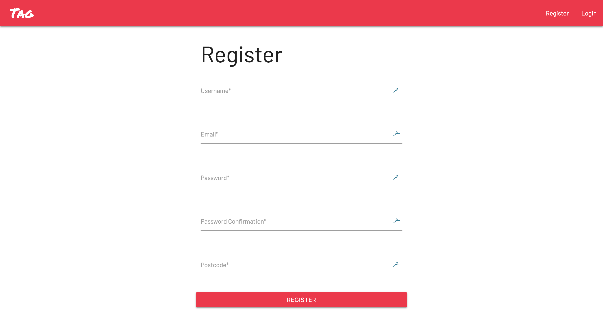
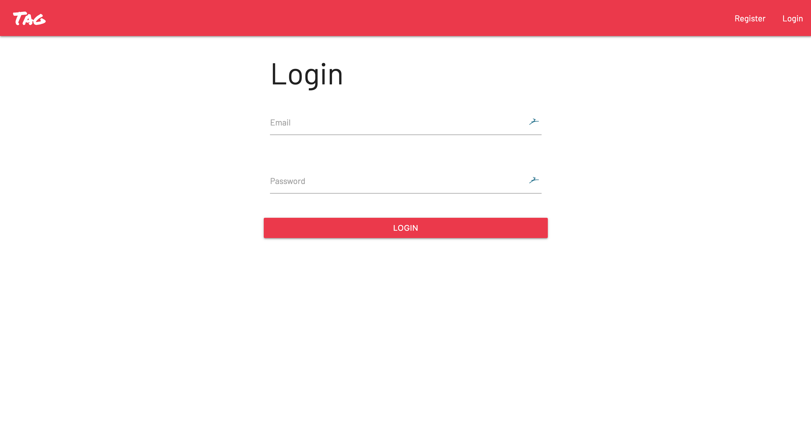
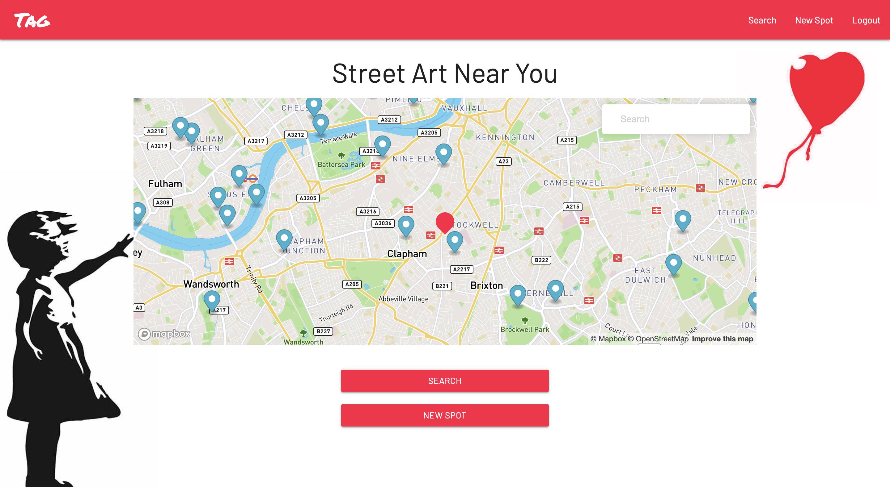
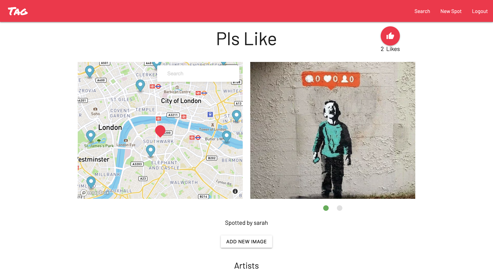
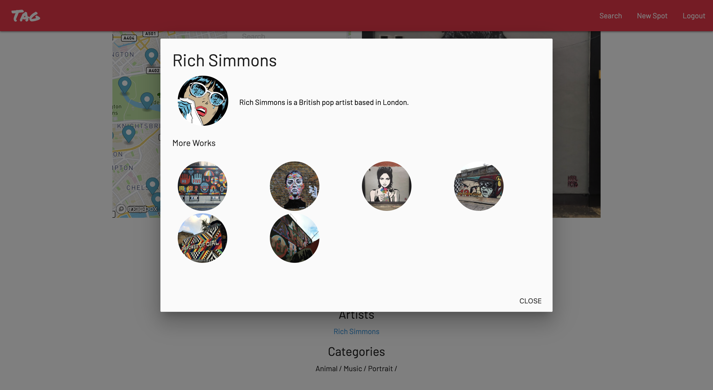
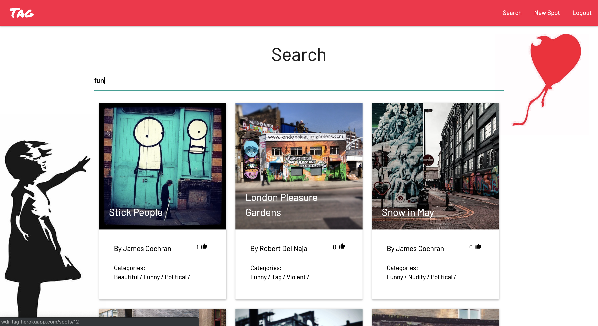
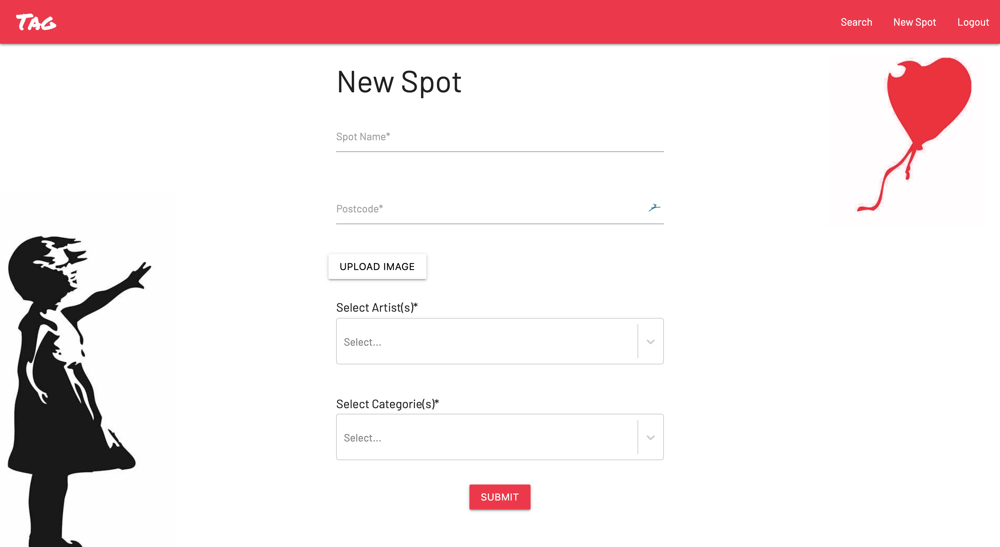
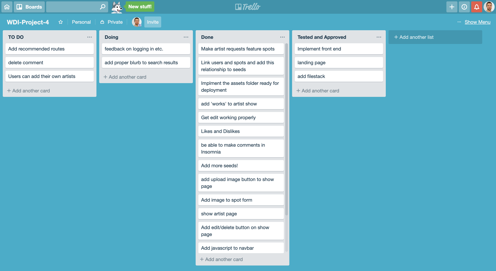
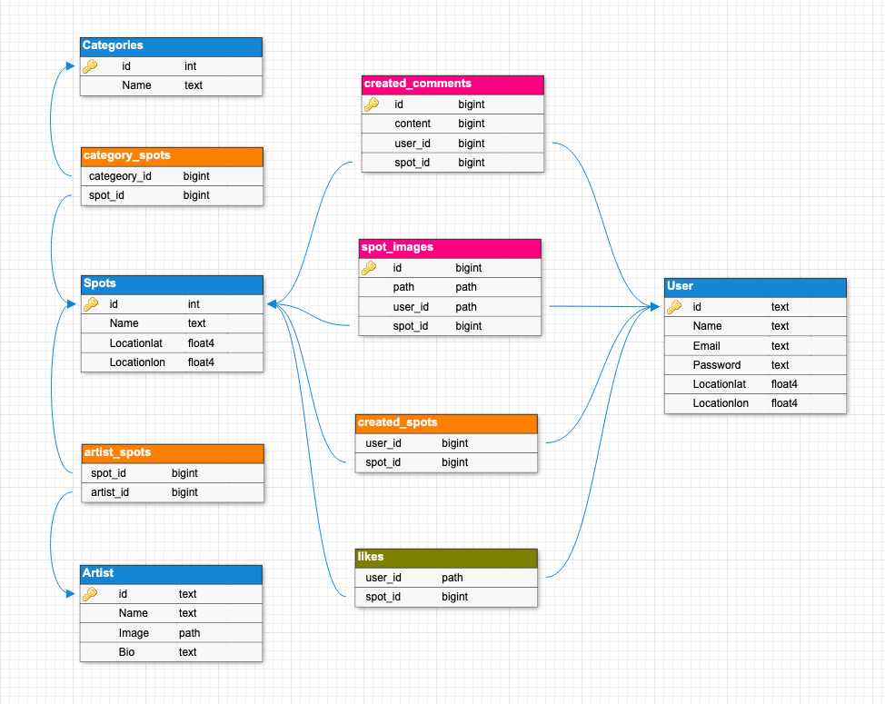
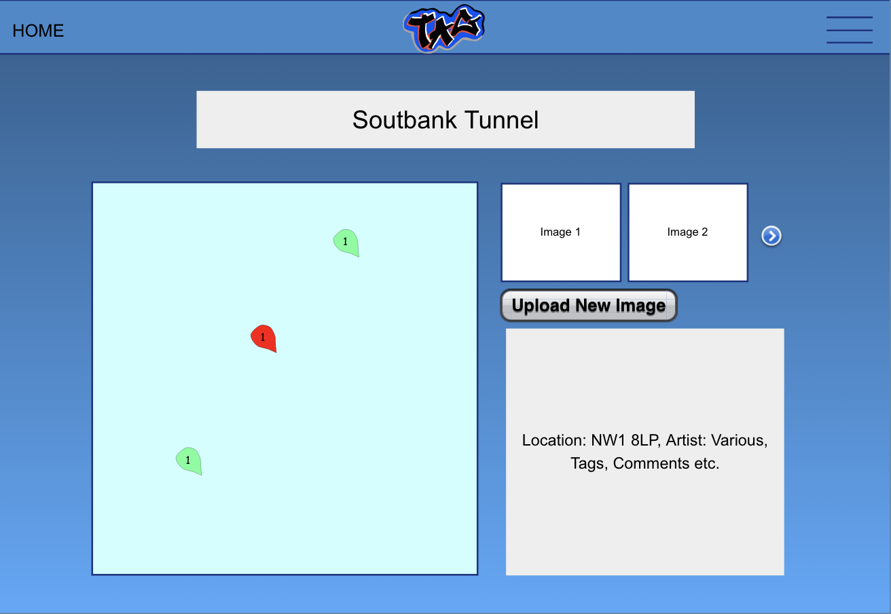

# General Assembly WDI Project 4: A Flack + React App

[Portfolio Link](http://wdi-tag.herokuapp.com/)

Tag was my final project of the Web Development Immersive course at General Assembly. It was my first project to feature Python and Flask for the backend, and SQL for my API database. I worked solo to make sure I had a firm grasp on everything the app incorporated.

---

## Brief

In 8 days I had to:

* **Build a full-stack application** by making your own backend and your own front-end
* **Use a Python Flask API** to serve your data from a Postgres database
* **Consume your API with a separate front-end** built with React
* **Be a complete product** which most likely means multiple relationships and CRUD functionality for at least a couple of models
* **Implement thoughtful user stories/wireframes** that are significant enough to help you know which features are core MVP and which you can cut
* **Have a visually impressive design** to kick your portfolio up a notch and have something to wow future clients & employers. **ALLOW** time for this.
* **Be deployed online** so it's publicly accessible.

## Technologies Used:

* JavaScript
* React
* HTML
* CSS
* Sass
* Python
* Flask
* SQL
* Materialize
* Mapbox
* OpenCage Geocoder
* Axios
* Filestack

## Approach Taken

Inspired by the amazing street art that features on walls around the Shoreditch area, for my final solo project I wanted to create an app that would allow people to find and appreciate street art easier. Using Python/Flask for the back end and JavaScript/React for the front end, I built Tag, a web app which allows users to find street art in their local area and elsewhere, plus also share their own spots.

<!-- As a user you can search all areas of central London for spots, browse the spots in more detail, browse the artist and see their other work, search spots, upload additional images to existing spots, and add your own spots. Other technologies used included SQL, Sass, Mapbox, OpenCage Geocoder, Materialize & Axios.

I hadn’t worked with maps before, which proved quite challenging but very rewarding as I love the idea of building apps that interact with the real world in some way. I’m really pleased with how it turned out, especially its responsiveness on mobile, which was a key design factor. Going forward with the project, I definitely want to add recommended walking routes for certain areas and also the ability to add authenticated artists. -->


---

## Screenshot Walk-through

### Landing page for logged-out users prompting register/login.


### Register page that allows user to register their details.



### Login page allows user to login.



### The user's homescreen is a centered map on the user's location, displaying all the nearby graffiti spots. The user also is given the option to search or create a new spot.



### The show spot page displays all the relevant information for that spot, including images, location, artists, categories. The page also allows the user to like the spot, add additional images to the spot and leave a comment. If the user is the creator of the spot or images they have the option to edit or delete the spot.



### The show artist modal, which activates once the artist is clicked, allows the user to read a short bio on the artist and also browse his other work.



### The search page defaults to all results and allows the user to browse freely and narrow down results by spot name, artist or categories.



### The New Spot Form allows you to add new spots.



___

### Functionality

The functionality works seamlessly with the real world to allow the user to:

* Register & login
* Search all areas of central London for spots
* Browse the spots in more detail
* Browse the artist and see their other work
* Search spots based on spot name, artist or category
* Upload additional images to existing spots
* Add your own spots

### Process
Once I settled upon my idea I got to work on the project straight away.
1.  To work efficiently I used Trello keep tabs of all my tasks.

2.  I used DB Designer to wireframe my backend and understand the relationships between the different models.

3.  I then used Pencil to wireframe the pages for my frontend.

4.  By day 2 I was happy with the wireframes, so I began work on our backend: creating the models, controllers, and then routes, all in Python/Flask.
5.  When I had created a sufficient seeds file and tested the routes in Insomnia I moved onto the front end using JavaScript/React.
6.  After day 6 I had reached an MVP level of completion, I began styling the app using the Materlize framework.

#### Featured piece of code 1

The Spot Model was the most complicated model as it incorporated most of the datasets and had various references to other tables. Links to other tables were made by referencing the ForeignKey of the linking dataset. Location had to be set by sepearting the Latitude and Longitude so these could be referenced by Mapbox later.

``` Python

class Spot(db.Model, BaseModel):

    __tablename__ = 'spots'

    id = db.Column(db.Integer, primary_key=True)
    name = db.Column(db.String(40), nullable=False, unique=True)
    locationlat = db.Column(db.Float, nullable=False)
    locationlon = db.Column(db.Float, nullable=False)
    categories = db.relationship('Category',
    secondary=categories_spots, backref='spots')
    artists = db.relationship('Artist',
    secondary=artists_spots, backref='spots')
    creator_id = db.Column(db.Integer, db.ForeignKey('users.id'))
    creator = db.relationship('User', backref='created_spots')
    liked_by = db.relationship('User', secondary=likes, backref='likes')


class SpotSchema(ma.ModelSchema):
    comments = fields.Nested(
    'CommentSchema', many=True,
    only=('content', 'id', 'created_at', 'creator')
    )
    images = fields.Nested('ImageSchema', many=True, only=('path', 'id', 'creator'))
    categories = fields.Nested('CategorySchema', many=True, only=('name', 'id'))
    artists = fields.Nested('ArtistSchema', many=True, only=('name', 'id', 'bio', 'image', 'spots'))
    creator = fields.Nested("UserSchema", only=('id', 'username'))
    liked_by = fields.Nested('UserSchema', many=True, only=('id', 'username'))

    class Meta:
        model = Spot

```

### Styling

Using Materialize CSS framework eleviated a lot of the pain points, such as creating a custom navbar or modals. it was my first departure from Bulma as a CSS framework and I'm glad I made the transition. It was a lot more customisable and made my app look far less generic. Colours and functionality were aplenty, meaning there was always something else I wanted to use or test. The modals and image slideshows were particularly effective additions to my app.

As for the general style of the app, I wanted it to look super slick. As street art prides itself on its own sense of style, this made it incredibly important to get the tone of the app right. I experimented with many colours, finally landing upon hot red (#ff1744) and white. I kept things fairly minimalistic in terms of imagery with a couple of flourishes here and there.

#### Featured piece of code 2

I was particularly proud of the artist modal that had to appear when the user clicked on the artist name on the show spot page. Once, launched it displayed the artist, a short bio and other works (which linked to their relevant spot). This was achieved by first mapping all of the artists onto the show spot page (as it allows for more than one), and then each artist having their own modal (a Materialize component) with all relevant info and mapping the various works of theirs.

``` JavaScript

  this.state.spot.artists.map((artist, i) => (
    <Modal key={i} header={artist.name} ref={el => this.artistmodal = el} trigger={<span className="pointer"><a>{artist.name}</a> </span>}>
      <div className="row valign-wrapper">
        <div className="col s5 m2 l2">
          
        </div>
        <div className="col s7 m10 l10">
          <span className="black-text">
            {artist.bio}
          </span>
        </div>
      </div>
      <h6><strong>More Works</strong></h6><br />
      <div className="row">
        {artist.spots.map((spot, i) => (
          <Link key={i} to={`/spots/${spot.id}`} onClick="OpenCloseModal()">
            <div className="col s6 m4 l3">
              
            </div>
          </Link>
        ))}
      </div>
    </Modal>))

```
___

### Wins and Blockers

The biggest blocker was working with Mapbox. I found some of the customisable elements and MapboxGeocoder quite difficult to implement, due to lack of instructions for React installation. It required a lot of additional css styling and documentation reading to finally find solutions for both. In the future I will look to use Google Maps or other map APIs as an alternative.

A huge win for this app was the responsiveness on mobile. I really wanted this to work best on mobile as I imagine that's how this app would be consumed the most on. I set about styling the app from mobile upwards - using sites like responsinator.com to check how it was looking on mobile. Thanks to Materlize this was really easy to accomplish - I shall be using this framework for any future mobile-centric apps.
___

## Future Features

If we had more time essential future features we would like to add include:

* Recommended Routes - the ability to choose certain areas and have a dedicated route planned out which would stop at all the essential spots. It could even have 'The Banksy Walk', where it would join all of Banksy's work together.
* Verified Artists - the ability for verified artists to claim anonymous pieces of art for themselves. Much like Twitter, artists could authenticate themselves as genuine.
* Another API that could incorporate other places onto the maps. For instance, coffee shops or bars could be featured to make a more holistic experience for the user.

___

## Key Learnings

Working solo for this project was both a curse and a blessing. Whilst it was a blessing in the sense I had a complete overview of everything the app did and how it worked, testing my knowledge to the limits, it did prove challenging when it came to issues as there was fewer people to assist. I found tasks took a lot longer than they did in the group projects, so I had to make sure I was prioritising my workload effectively. It meant I had to scale back my ambitions occasionally to allow me to reach the deadlines on time. I'm really pleased that I solved a problem in the real world, so this is definitely something I want to pursue more in my side projects going forward. This will require a lot more time spent when map and coordinate APIs, which can be quite challenging at times.
